# Dior Value Retention & Market Intelligence System
### *EDHEC Business Data Management Project - 2026*

This repository is our end-to-end data pipeline designed to monitor, analyze, and predict the investment value of Dior luxury goods. By integrating retail data from Dior with secondary market listings (Rebag, Vestiaire Collective), the system calculates a proprietary **Resale Value Retention (RVR)** metric.

---

## 🎯 Project Intent

### Core Research Question
**Which Dior products behave like long-term value-retaining assets on the secondary market, and what characteristics explain this behavior?**

We are not analyzing resale for curiosity we are using **resale prices as a signal of perceived value, scarcity, and pricing efficiency**. This project treats luxury goods as financial instruments, measuring their ability to retain or appreciate in value post-purchase.

### Why This Matters for Dior

This analysis provides actionable strategic intelligence:

| Strategic Goal | How This Project Helps |
|:---|:---|
| **Identify Underpriced Products** | Products reselling near or above retail indicate unrealized pricing power. Dior can adjust pricing strategies accordingly. |
| **Detect "Icon" Candidates Early** | Strong resale retention often precedes long-term brand icons (e.g., Lady Dior, Saddle Bag). Early detection enables focused marketing investment. |
| **Evaluate Scarcity Strategy** | Products no longer available at retail but strong on resale indicate effective scarcity management and brand desirability. |
| **Protect Brand Equity** | Weak resale performance can flag overexposure, poor quality perception, or market saturation—allowing corrective action. |

### The RVR Metric

**Resale Value Retention (RVR)** is our proprietary metric:

$$
\text{RVR} = \frac{\text{Median Resale Price (EUR)}}{\text{Retail Price (EUR)}} \times 100
$$

**Classification:**
- **RVR ≥ 100%** → Investment-like (appreciating asset)
- **90% ≤ RVR < 100%** → Value-retaining (minimal depreciation)
- **RVR < 90%** → Depreciating (typical consumer good behavior)

This metric allows Dior to benchmark products against financial assets rather than traditional consumer goods.


## 🏗 System Architecture

The project follows a modular **ELT (Extract, Load, Transform)** architecture, containerized for scalability and deployed with a FastAPI management layer.

```mermaid
graph TB
    subgraph Sources["🌐 External Data Sources"]
        Dior["Dior Official<br/>(Retail Prices)"]
        Rebag["Rebag<br/>(Resale Market)"]
        Vestiaire["Vestiaire Collective<br/>(Resale Market)"]
    end

    subgraph Scrapers["📥 Data Acquisition Layer"]
        DS[Dior Scraper]
        RS[Rebag Scraper]
        VS[Vestiaire Scraper]
    end

    subgraph Processing["⚙️ Processing & Analytics"]
        Normalizer[Data Normalizer]
        Matcher[Product Matching Engine]
        RVR[RVR Calculator]
    end

    subgraph Storage["💾 Cloud Storage"]
        BQ[(Google BigQuery<br/>Unified Data Mart)]
    end

    subgraph Access["🔌 Access & Visualization"]
        API[FastAPI Service]
        Notebook[Jupyter Analysis]
        PowerBI[Power BI Dashboard]
        Scheduler[Daily Automation]
    end

    %% Data Flow
    Dior --> DS
    Rebag --> RS
    Vestiaire --> VS

    DS --> Normalizer
    RS --> Normalizer
    VS --> Normalizer
    
    Normalizer --> Matcher
    Matcher --> RVR
    RVR --> BQ
    
    BQ --> API
    BQ --> Notebook
    BQ --> PowerBI
    
    Scheduler -.triggers.-> API
```



**How the System Works:**

1. **Data Acquisition**: Automated scrapers collect product listings from Dior's official site (retail prices) and secondary markets (Rebag, Vestiaire Collective).

2. **Normalization**: Raw data is cleaned and standardized—product names are harmonized across different languages and platforms (e.g., "Sac" → "Bag").

3. **Product Matching Engine**: Uses intelligent text similarity algorithms to match the same product across retail and resale platforms, even when names differ slightly.

4. **RVR Calculation**: For matched products, we calculate the Resale Value Retention metric to identify which items hold their value best.

5. **Unified Storage**: All processed data flows into Google BigQuery, creating a single source of truth for analytics.

6. **Multi-Channel Access**: Data is accessible via FastAPI endpoints, Jupyter notebooks for deep analysis, and Power BI for executive dashboards.


---

## 📊 Data Sources & Methodology

### Data Sources

| Source | Role | Justification |
|:---|:---|:---|
| **Dior Official Website** | Retail ground truth | Establishes current pricing, availability, and product catalog. |
| **Vestiaire Collective** | Secondary-market valuation | EU-focused resale platform with authenticated luxury goods. |
| **Rebag** | Secondary-market valuation (US) | US-focused resale platform for cross-market comparison. |
| **EDHEC BigQuery Dataset** | Historical retail context | Provides lifecycle data (price changes, discontinuation dates). |
| **FX API** | Currency normalization | Ensures all prices are comparable in EUR. |

### Matching Logic

**Challenge:** Retail and resale platforms use different naming conventions (e.g., "Sac Lady Dior Medium" vs "Lady Dior Bag").

**Solution:** Our **Product Matching Engine** uses:
1. **Category Harmonization**: Maps "Sacs" → "Bags", "Bijoux" → "Jewelry"
2. **Text Normalization**: Removes brand names, colors, sizes, and special characters
3. **Fuzzy Similarity**: Matches products with ≥70% name similarity
4. **Price Validation**: Resale price must be within ±40% of retail to avoid false matches

**Aggregation:** Multiple resale listings are aggregated using the **median price** to reduce outlier influence.

### Key Assumptions

> [!IMPORTANT]
> **Scope Limitation**: This project focuses on **Bags** category to ensure depth over breadth.

> [!NOTE]
> **No Perfect SKU Matching**: Resale platforms rarely include manufacturer SKUs. We rely on intelligent text matching instead.

> [!NOTE]
> **Liquidity Signal**: We limit to ~10 resale listings per product. The goal is to detect value signals, not exhaustive market coverage.

---

## 📂 Repository Structure

The project is organized to ensure clear separation of concerns, facilitating both local development and containerized deployment.

```
Business_Data_Management_EDHEC_2026_DIOR/
├── api/                    # FastAPI service
│   ├── __init__.py
│   └── main.py
├── docker/                 # Containerization
│   ├── Dockerfile
│   └── docker-compose.yml
├── src/                    # Core modules
│   ├── analytics/          # Normalization & matching
│   ├── automation/         # Scheduling
│   ├── database/           # BigQuery integration
│   └── scrapers/           # Dior, Rebag, Vestiaire
├── tests/                  # Test suite
│   ├── README.md
│   ├── test_main.py
│   └── test_scrapers.py
├── .env.example            # Environment template
├── .gitignore              # Comprehensive exclusions
├── Dior_Data_Management.ipynb  # Analysis notebook
├── Makefile                # Automation commands
├── README.md               # Complete documentation
├── pyproject.toml          # Package configuration
├── requirements.txt        # Dependencies
├── run_pipeline.py         # Main orchestrator
├── setup.py                # Package setup
└── setup.sh                # Setup script
```

---

## 🚀 Getting Started

### Prerequisites
- Python 3.12+
- Google Cloud Platform Account (BigQuery)
- Playwright (Chromium)

### Local Development
The project uses a `Makefile` to simplify common operations.

1. **Initialize Project:**
   ```bash
   make setup
   ```
   *This creates a venv, installs dependencies, and sets up Playwright.*

2. **Configure Environment:**
   Create a `.env` file (see `.env.example`) with your BigQuery credentials:
   ```env
   GOOGLE_CLOUD_PROJECT=your-project-id
   GOOGLE_APPLICATION_CREDENTIALS=path/to/creds.json
   DIOR_TABLE_ID=data_management_projet.dior_data
   ```

3. **Run Full Pipeline:**
   ```bash
   make pipeline
   ```

---

## 🐳 Containerization

The system is fully containerized using **Docker** to ensure that the complex Playwright dependencies and environment variables are preserved across different infrastructure.

### Building & Running with Docker
The `docker/` directory contains everything needed to spin up the entire system.

```bash
docker-compose -f docker/docker-compose.yml up --build
```

**What happens inside the container?**
- A headless Chromium instance is provisioned for scraping.
- The FastAPI server starts on port `8000`.
- The background scheduler initiates daily scrapes automatically.

---

## 📊 Data Management & Strategy

### 1. Data Normalization
Luxury goods often have inconsistent naming across platforms. Our `DataNormalizer` uses regex-based cleaning and category mapping to ensure "Bags" on Dior correctly matches "Sac" or "Shoulder Bag" on secondary markets.

### 2. Fuzzy Matching & RVR
We utilize a `ValueAnalyzer` that performs name-based fuzzy matching. Once a match is confirmed between a retail price ($P_r$) and a resale price ($P_s$), we calculate:
$$RVR = \frac{Price_{Resale}}{Price_{Retail}} \times 100$$
High RVR values indicate "Investment Hotspots" suitable for resale arbitrage or long-term value retention.

### 3. BigQuery Data Mart
Data is injected into a unified BigQuery table, allowing for:
- **Time-series analysis** of Dior prices.
- **Cross-market comparison** between US (Rebag) and EU (Vestiaire/Dior) markets.
- **Power BI connectivity** for live executive dashboards.

---

## 🛠 Usage & API

| Endpoint | Method | Purpose |
| :--- | :--- | :--- |
| `/pipeline/run` | POST | Trigger the full scrape-patch-upload sequence. |
| `/data/dior` | GET | Retrieve live data from BigQuery with pagination. |
| `/analytics/summary` | GET | High-level market stats (Avg Price, Last Scraped). |
| `/analytics/investment-hotspots`| GET | Returns products with >90% resale value retention. |

---

## 🎓 Organization
This project was developed for the **EDHEC Business Data Management (2026)** course. It represents a professional-grade implementation of modern data engineering practices, combining web automation, cloud databases, and business intelligence.
