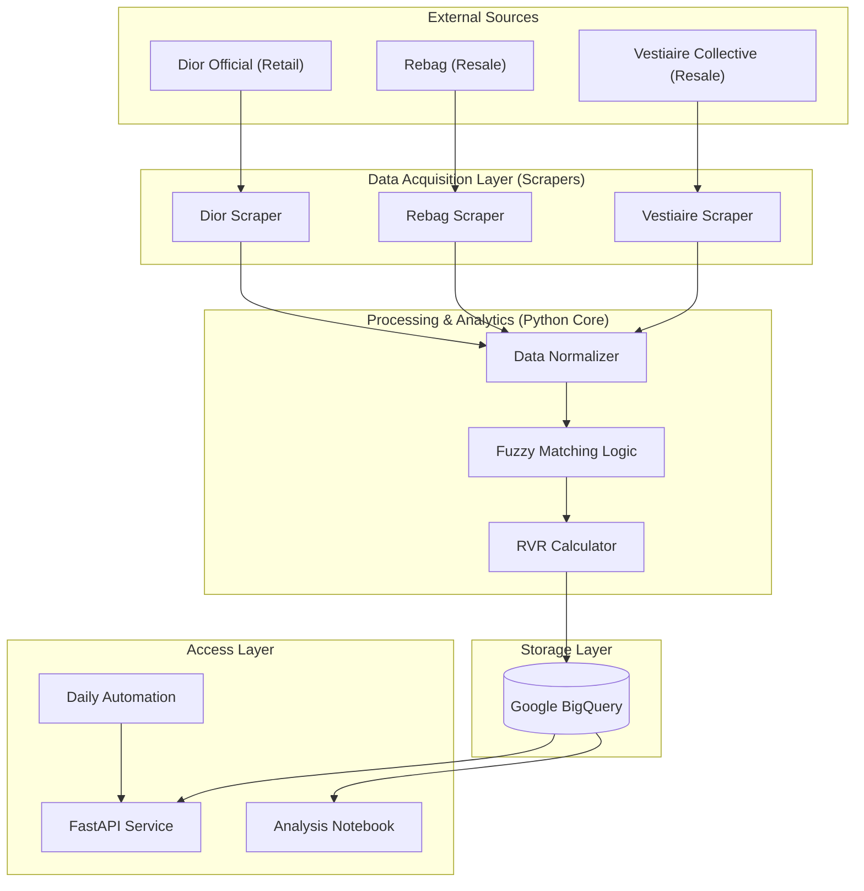

# 💎 Dior Value Retention & Market Intelligence System
### *EDHEC Business Data Management Project - 2026*

This repository hosts a sophisticated end-to-end data pipeline designed to monitor, analyze, and predict the investment value of Dior luxury goods. By integrating retail data from Dior with secondary market listings (Rebag, Vestiaire Collective), the system calculates a proprietary **Resale Value Retention (RVR)** metric.

---

## 🏗 System Architecture

The project follows a modular **ELT (Extract, Load, Transform)** architecture, containerized for scalability and deployed with a FastAPI management layer.



---

## 📂 Repository Structure

The project is organized to ensure clear separation of concerns, facilitating both local development and containerized deployment.

| Directory / File | Description |
| :--- | :--- |
| `api/` | FastAPI server implementation, including background tasks and schedulers. |
| `src/scrapers/` | Playwright & BeautifulSoup based crawlers for luxury e-commerce. |
| `src/analytics/` | Text normalization, category harmonization, and fuzzy matching algorithms. |
| `src/database/` | BigQuery managers and schema-aware data injection logic. |
| `src/automation/` | Cron-like scheduling for daily pipeline execution. |
| `docker/` | Dockerfile and Compose configurations for consistent environments. |
| `run_pipeline.py` | The main entry point for the sequential analytical pipeline. |
| `Makefile` | Orchestration tool for setup, testing, and execution. |

---

## 🚀 Getting Started

### Prerequisites
- Python 3.12+
- Google Cloud Platform Account (BigQuery)
- Playwright (Chromium)

### Local Development
The project uses a `Makefile` to simplify common operations.

1. **Initialize Project:**
   ```bash
   make setup
   ```
   *This creates a venv, installs dependencies, and sets up Playwright.*

2. **Configure Environment:**
   Create a `.env` file (see `.env.example`) with your BigQuery credentials:
   ```env
   GOOGLE_CLOUD_PROJECT=your-project-id
   GOOGLE_APPLICATION_CREDENTIALS=path/to/creds.json
   DIOR_TABLE_ID=data_management_projet.dior_data
   ```

3. **Run Full Pipeline:**
   ```bash
   make pipeline
   ```

---

## 🐳 Containerization

The system is fully containerized using **Docker** to ensure that the complex Playwright dependencies and environment variables are preserved across different infrastructure.

### Building & Running with Docker
The `docker/` directory contains everything needed to spin up the entire system.

```bash
docker-compose -f docker/docker-compose.yml up --build
```

**What happens inside the container?**
- A headless Chromium instance is provisioned for scraping.
- The FastAPI server starts on port `8000`.
- The background scheduler initiates daily scrapes automatically.

---

## 📊 Data Management & Strategy

### 1. Data Normalization
Luxury goods often have inconsistent naming across platforms. Our `DataNormalizer` uses regex-based cleaning and category mapping to ensure "Bags" on Dior correctly matches "Sac" or "Shoulder Bag" on secondary markets.

### 2. Fuzzy Matching & RVR
We utilize a `ValueAnalyzer` that performs name-based fuzzy matching. Once a match is confirmed between a retail price ($P_r$) and a resale price ($P_s$), we calculate:
$$RVR = \frac{Price_{Resale}}{Price_{Retail}} \times 100$$
High RVR values indicate "Investment Hotspots" suitable for resale arbitrage or long-term value retention.

### 3. BigQuery Data Mart
Data is injected into a unified BigQuery table, allowing for:
- **Time-series analysis** of Dior prices.
- **Cross-market comparison** between US (Rebag) and EU (Vestiaire/Dior) markets.
- **Power BI connectivity** for live executive dashboards.

---

## 🛠 Usage & API

| Endpoint | Method | Purpose |
| :--- | :--- | :--- |
| `/pipeline/run` | POST | Trigger the full scrape-patch-upload sequence. |
| `/data/dior` | GET | Retrieve live data from BigQuery with pagination. |
| `/analytics/summary` | GET | High-level market stats (Avg Price, Last Scraped). |
| `/analytics/investment-hotspots`| GET | Returns products with >90% resale value retention. |

---

## 🎓 Organization
This project was developed for the **EDHEC Business Data Management (2026)** course. It represents a professional-grade implementation of modern data engineering practices, combining web automation, cloud databases, and business intelligence.